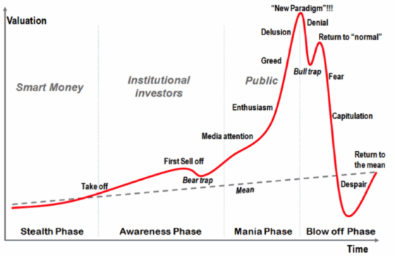
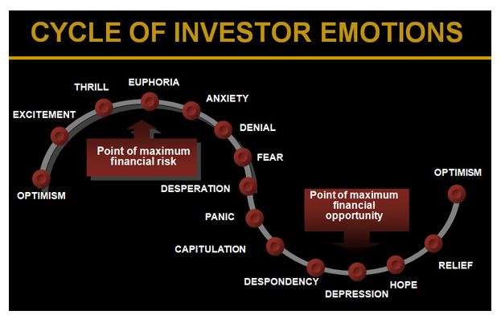
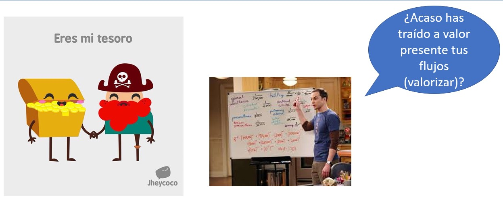
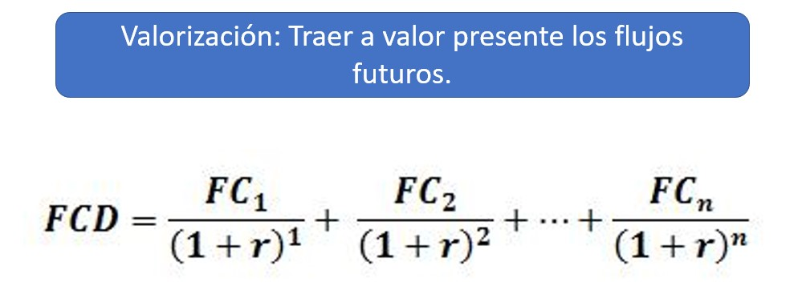
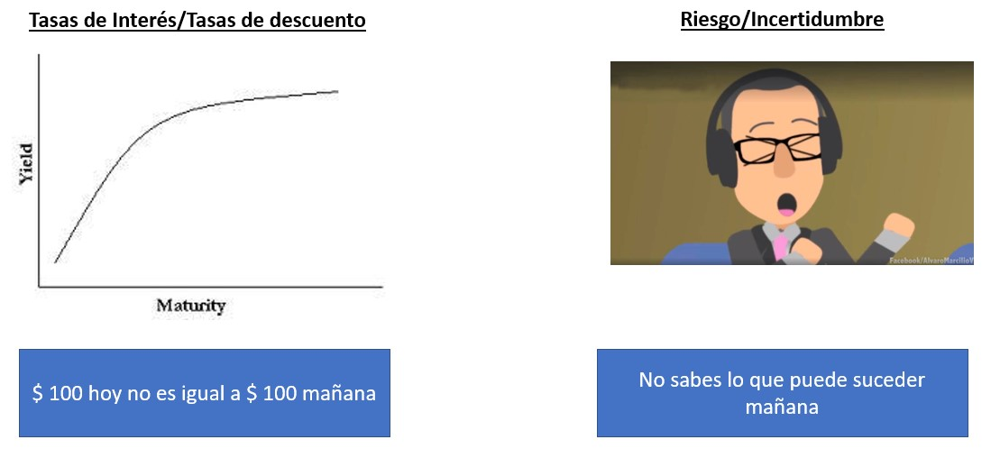
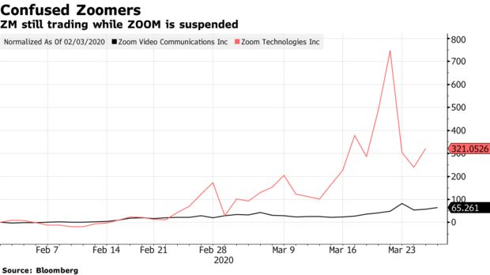

```{r images, include=FALSE}
include_image <- function(path,                           
                          html_opts = "width=45%", 
                          latex_opts = html_opts,
                          alt_text = ""){
  if(knitr:::is_html_output()){
    glue::glue("{{ {html_opts} }}")
  } else if(knitr:::is_latex_output()){
    glue::glue("{{ {latex_opts} }}")    
  }
}
image_link <- function(path,
                       link,
                       html_opts = "height: 200px;",
                       latex_opts = "width=0.2\\textwidth",
                       alt_text = "",
                       centering = TRUE){
  if(knitr:::is_html_output()){
    if(centering){
    glue::glue('
      <center><a target="_blank" class="page-link" href="{link}"></a></center>')
    } else {
      glue::glue('
      <a target="_blank" class="page-link" href="{link}"></a>')
    }
  }
  else if(knitr:::is_latex_output()){
    if(centering){
      glue::glue('\\begin{{center}}
        \\href{{{link}}}{{\\includegraphics[{latex_opts}]{{{path}}}}}
        \\end{{center}}')
    } else
      glue::glue('\\href{{{link}}}{{\\includegraphics[{latex_opts}]{{{path}}}}}')
  }
  
}
```

```{r initial, echo = FALSE, cache = FALSE, results = 'hide',warning=FALSE}
library(knitr)
options(htmltools.dir.version = FALSE, tibble.width = 55, tibble.print_min = 4)
opts_chunk$set(
  echo = FALSE, warning = FALSE, message = FALSE, comment = "#>",
  fig.path = 'figure/', cache.path = 'cache/', fig.align = 'center', 
  fig.width = 12, fig.show = 'hold', fig.height = 8.5, # 16:9
  cache = TRUE, external = TRUE, dev = 'svglite'
)
read_chunk('R/theme.R')
read_chunk('R/main.R')
```

```{r theme-remark}
```

## ¿Qué se nos viene a la mente con Finanzas Conductuales? `r emo::ji("thinking")`

<br>


.center[

.animated.bounce[

]
]

.footnote[[Imagen extraída de Asset Macro](https://www.assetmacro.com/financial-terms/behavioral-finance/)]

---

## ¿Qué se nos viene a la mente con Finanzas Conductuales? `r emo::ji("thinking")`

<br>


.center[

.animated.bounce[

]
]

.footnote[[Imagen extraída de  ballastplan.com](https://ballastplan.com/behavioral-finance-and-asset-allocation/)]

---

## Definiendo Behavioral Finance `r emo::ji("nerd_face")`

>Behavioral finance, a sub-field of behavioral economics, proposes that psychological influences and biases affect the financial behaviors of investors and financial practitioners. Moreover, influences and biases can be the source for explanation of all types of market anomalies and specifically market anomalies in the stock market, such as severe rises or falls in stock price.

> **Investopedia**

???

---


## ¿Qué tan útil puede ser Finanzas conductuales para un inversionista no institucional?

.center[

]

---


## ¿Cómo muchos inversionistas no institucionales han aprendido en la práctica?

.center[

]


???

---

## ¿Será la llave `r emo::ji("key")` para desbloquear el poder del ultra instinto?

.center[
<div style="width:50%;height:0;padding-bottom:50%;position:relative;"><iframe src="https://giphy.com/embed/1gVUhlXhETaRRxzeHO" width="100%" height="100%" style="position:absolute" frameBorder="0" class="giphy-embed" allowFullScreen></iframe></div><p><a href="https://giphy.com/gifs/goku-ultra-instinct-1gVUhlXhETaRRxzeHO"></a></p>
]


???


---
class: inverse middle center

## Hora de los conceptos

.center[

.animated.bounce[

]
]

---

## Introducción a la Valorización `r emo::ji("smiley")`

.center[

]

---

## Introducción a la Valorización `r emo::ji("smiley")`

.center[

]


---

## Introducción a la Valorización `r emo::ji("smiley")`

.center[

]

c

---

## Ya tenemos el poder de los conceptos `r emo::ji("sunglasses")`

Ahora sí entremos específicamente a Behavioral finance.

<div style="width:100%;height:0;padding-bottom:41%;position:relative;"><iframe src="https://giphy.com/embed/U7L2ERMbzXtt6b6g7c" width="100%" height="100%" style="position:absolute" frameBorder="0" class="giphy-embed" allowFullScreen></iframe></div><p><a href="https://giphy.com/gifs/BoxOfficetr-avengers-venom-jurassic-world-U7L2ERMbzXtt6b6g7c"></a></p>


???

---
class: inverse middle center

## Finanzas conductuales en la realidad

.animated.bounce[

]


???


---

## 4 Casuísticas

1. Mercado inmobiliario. 
2. Mercado de Renta Variable.
3. Anomalías.
4. Casos curiosos.

---

## Caso 1: Mercado inmobiliario

* ¿Por qué quieres comprar un inmueble?
* Si tu respuesta es: **están subiendo los precios o los precios nunca caen...** Podrías estar tomando una mala decisión o una decisión desinformada.

---

## Caso 1: Mercado inmobiliario

.center[

]

---

## Caso 1: Mercado inmobiliario

.center[

]


---

## Caso 2: Mercado de Renta Variable

* ¿Por qué quieres comprar esa acción?
* Si tu respuesta es: **están subiendo los precios o los precios nunca caen...** Podrías estar tomando una mala decisión o una decisión desinformada.

---

## Caso 2: Mercado de Renta Variable

.center[

]

---

## Caso 2: Mercado de Renta Variable

.center[

]

---

## Caso 3: Anomalías de mercado

.center[

]

---

## Caso 3: Anomalías de mercado

.center[

]

---

## Caso 3: Anomalías de mercado

.center[

]

---

## Caso 4: Casos curiosos

.center[

]

---

## Caso 4: Casos curiosos

El CUBA Fund es un fondo cerrado que invierte en instrumentos financieros que no están relacionados a Cuba, sólo tiene coincidencia en sus siglas. Algo normal en los fondos cerrados es que el precio esté a 10% a 15% de descuento respecto al NAV (Net Asset Value). Después de un anuncio que favorece a los instrumentos financieros de CUBA, se observa que Precio supera el NAV, siendo la diferencia 70%.


.center[

]

---
class: inverse middle center

## ¿Más información?

.animated.bounce[

]


???


---
class: middle center

.card[
  [.tidyverts[CFA .orange[Institute]]](https://www.cfainstitute.org/)
]

<br>
  
.card[
  
    
[**CFA Institute**](https://www.cfainstitute.org/)
]


---
class: middle center

.card[
[.tidyverts[Economía Conductual y .orange[Ciencia de datos]]](https://besteamperu.org/)
]

<br>

.card[

[**BEST**](https://besteamperu.org/)
]

---
class: middle center

.card[
  [.tidyverts[Página web .orange[personal]]](https://arturochian.netlify.app)
]

<br>
  
.card[
  
    
[**Arturo Chian**](https://arturochian.netlify.app)
]
 
 


---
background-image: url(img/gracias.png)
background-position: 50% 25%
class: center, bottom, inverse